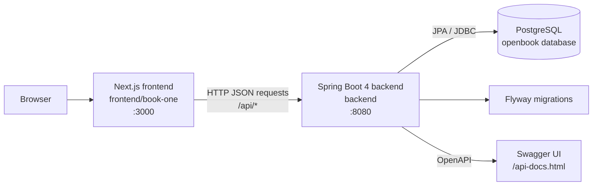

# OpenBook

[](backend/README.md)
[](frontend/book-one/README.md)
[](https://www.oracle.com/java/technologies/downloads/)
[](https://nodejs.org/)

OpenBook is a full-stack application for managing a structured personal library. The repository contains two cooperating projects:

| Component | Location | Responsibility | Default local URL |
| --- | --- | --- | --- |
| Backend | [`backend/`](backend/) | Spring Boot 4 REST API, JWT authentication, PostgreSQL persistence, Flyway migrations, and API documentation. | `http://localhost:8080` |
| Frontend | [`frontend/book-one/`](frontend/book-one/) | Next.js application that provides the Book One user interface and consumes the backend API. | `http://localhost:3000` |

## Architecture

The frontend and backend are independently runnable applications. The frontend sends HTTP requests to the backend API, while the backend validates requests, applies business rules, reads or writes PostgreSQL data, and returns JSON responses.



### API connection

The connection is configured in the frontend Axios client:

```text
frontend/book-one/lib/api/api-axios.ts
        |
        | baseURL = NEXT_PUBLIC_API_URL
        v
http://localhost:8080/api/...
        |
        v
backend controllers under /api
```

Set the frontend API base URL in `frontend/book-one/.env.local`:

```dotenv
NEXT_PUBLIC_API_URL=http://localhost:8080/api
NEXT_SWAGGER_URL=http://localhost:8080/v3/api-docs
```

The frontend service classes append resource paths such as `/books`, `/users`, and `/bookmarks` to the configured Axios base URL. With the example above, a request to the books service resolves to `http://localhost:8080/api/books`.

When an `authToken` cookie is present, the frontend adds it to API requests as:

```http
Authorization: Bearer <jwt-token>
```

The backend uses its JWT filter to validate the token. The backend currently enables permissive CORS for all origins, methods, and headers; tighten this configuration before production deployment.

## API surface

The backend exposes REST resources under `/api`:

| Resource | Representative endpoints | Purpose |
| --- | --- | --- |
| Users | `GET /api/users`, `POST /api/users`, `POST /api/users/authenticate` | User management and JWT authentication. |
| Books | `GET /api/books`, `POST /api/books`, `PUT /api/books/{id}` | Manage books. |
| Chapters | `GET /api/chapters`, `POST /api/chapters` | Manage chapters in the book hierarchy. |
| Pages | `GET /api/pages`, `POST /api/pages` | Manage pages. |
| Lines | `GET /api/lines`, `POST /api/lines` | Manage lines. |
| User books | `GET /api/userbooks/users/{userId}/books`, `POST /api/userbooks` | Associate users with books. |
| Bookmarks | `GET /api/bookmarks`, `POST /api/bookmarks`, `DELETE /api/bookmarks/{id}` | Manage bookmarked content. |

Successful responses use the backend’s `ApiResponse` wrapper. Request and response DTOs define the payloads for each resource. The complete endpoint reference is available through the backend’s Swagger UI.

## Prerequisites

Install the tools required by both components:

| Tool | Requirement | Used by |
| --- | --- | --- |
| JDK | 21 or newer | Spring Boot backend |
| PostgreSQL | A running database instance | Backend persistence |
| Node.js | 20 or newer | Next.js frontend |
| pnpm | 9 or newer recommended | Frontend dependencies and scripts |
| Git | Recent version | Repository management |

## Quick start

Start the backend first so the frontend has an API to call.

### 1. Start PostgreSQL

Create a database and user matching the backend defaults, or override the database properties in the backend configuration:

```sql

```

The default backend connection is:

```text
jdbc:postgresql://localhost:5432/openbook?sslmode=disable
```

Flyway applies migrations from `backend/src/main/resources/db/migration` when the backend starts.

### 2. Start the backend

```bash
cd backend
./mvnw clean verify
./mvnw spring-boot:run
```

The API is available at `http://localhost:8080`. See [`backend/README.md`](backend/README.md) for configuration properties, authentication details, deployment notes, and the full endpoint list.

### 3. Configure and start the frontend

In a second terminal:

```bash
cd frontend/book-one
pnpm install --frozen-lockfile
```

Create `frontend/book-one/.env.local`:

```dotenv
NEXT_PUBLIC_API_URL=http://localhost:8080/api
NEXT_SWAGGER_URL=http://localhost:8080/v3/api-docs
```

Start Next.js:

```bash
pnpm dev
```

Open the application at:

- [Book One workspace](http://localhost:3000/book-one)
- [Frontend API documentation view](http://localhost:3000/api-doc)
- [Backend Swagger UI](http://localhost:8080/api-docs.html)

## Component documentation

| Project | Documentation |
| --- | --- |
| Spring Boot backend | [`backend/README.md`](backend/README.md) |
| Next.js frontend | [`frontend/book-one/README.md`](frontend/book-one/README.md) |

The component READMEs contain their individual build scripts, configuration tables, directory structures, testing commands, and implementation notes.

## Repository structure

```text
openbook/
├── backend/                 # Spring Boot 4 API and database integration
│   ├── src/main/java/       # Controllers, services, repositories, security, and domain models
│   ├── src/main/resources/  # Spring configuration and Flyway migrations
│   ├── src/test/java/       # Backend tests
│   ├── mvnw                 # Maven Wrapper for Unix-like systems
│   └── pom.xml              # Backend Maven build definition
├── frontend/
│   └── book-one/            # Next.js frontend application
│       ├── app/              # App Router pages and API route handlers
│       ├── components/       # Layout, form, and UI components
│       ├── hooks/            # Client-side hooks
│       ├── lib/              # Axios clients and utilities
│       ├── services/         # Typed API service classes
│       ├── types/            # TypeScript domain types
│       └── package.json      # Frontend scripts and dependencies
└── README.md                # Full-stack project overview
```

## Development workflow

1. Start PostgreSQL.
2. Start the backend and confirm that `http://localhost:8080/api-docs.html` loads.
3. Set `NEXT_PUBLIC_API_URL` to the backend API base URL, including `/api`.
4. Start the frontend.
5. Authenticate through the frontend or `POST /api/users/authenticate`; subsequent requests can include the returned JWT.
6. Use the backend Swagger UI to inspect and exercise API endpoints independently of the frontend.

For component-specific changes, run the relevant checks from that component directory:

```bash
# Backend
cd backend
./mvnw test

# Frontend
cd frontend/book-one
pnpm lint
pnpm test
pnpm build
```

## Configuration relationship

| Concern | Backend | Frontend |
| --- | --- | --- |
| API host | Runs on `server.port` (default `8080`). | Reads `NEXT_PUBLIC_API_URL`. |
| Database | Reads `vars.db.*` and connects to PostgreSQL. | Does not connect directly to the database. |
| Authentication | Signs and validates JWTs using `JWT_SECRET`. | Reads the `authToken` cookie and sends a bearer header. |
| API documentation | Serves Swagger UI at `/api-docs.html` and OpenAPI JSON at `/v3/api-docs`. | Embeds the OpenAPI URL through `NEXT_SWAGGER_URL` on `/api-doc`. |
| CORS | Allows cross-origin API requests in the current configuration. | Calls the backend from the browser. |

## Security notes

- Replace the backend’s development JWT fallback with a strong external `JWT_SECRET`.
- Replace the default PostgreSQL credentials outside local development.
- Restrict CORS to trusted frontend origins before production deployment.
- Review public Swagger and Actuator exposure for the target environment.
- Never commit `.env.local`, production credentials, or bearer tokens.
